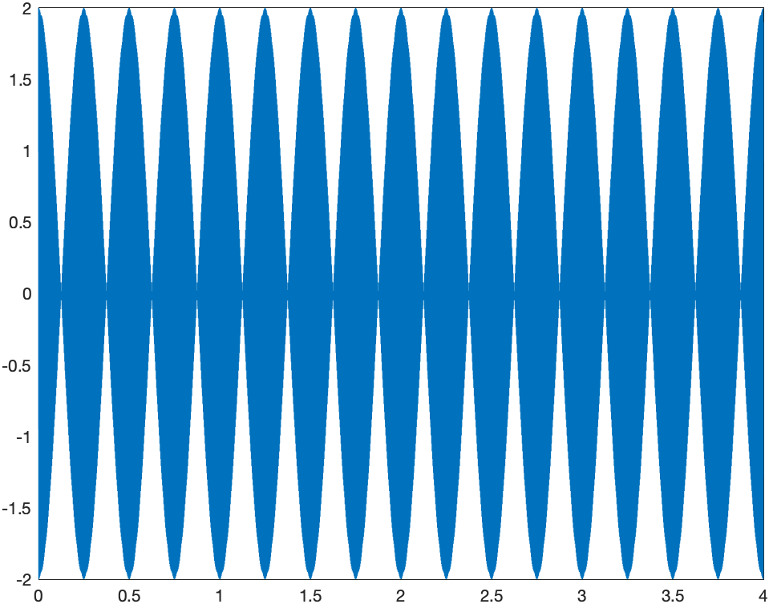
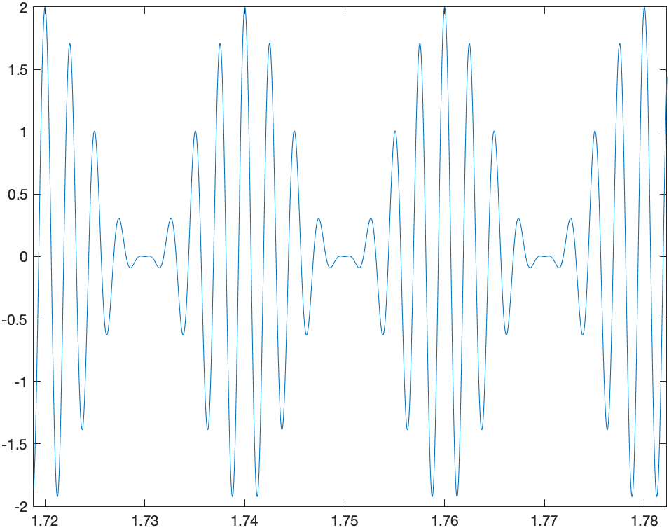
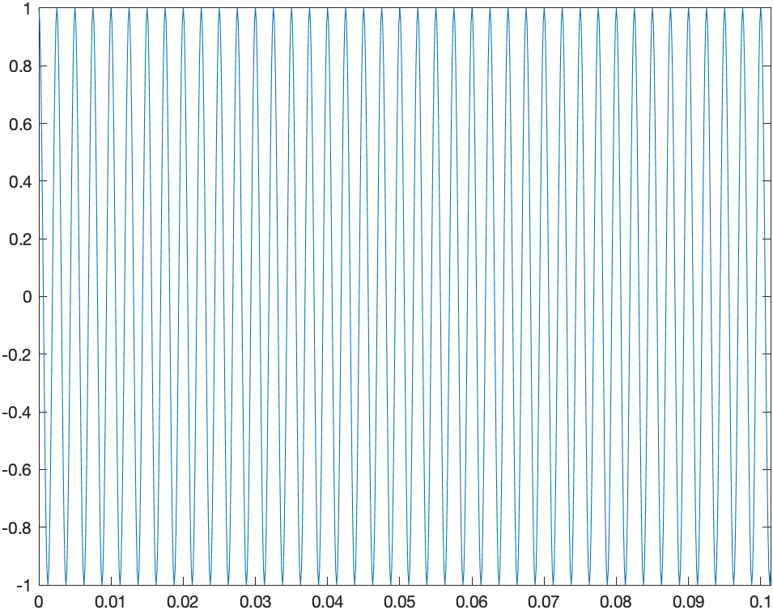
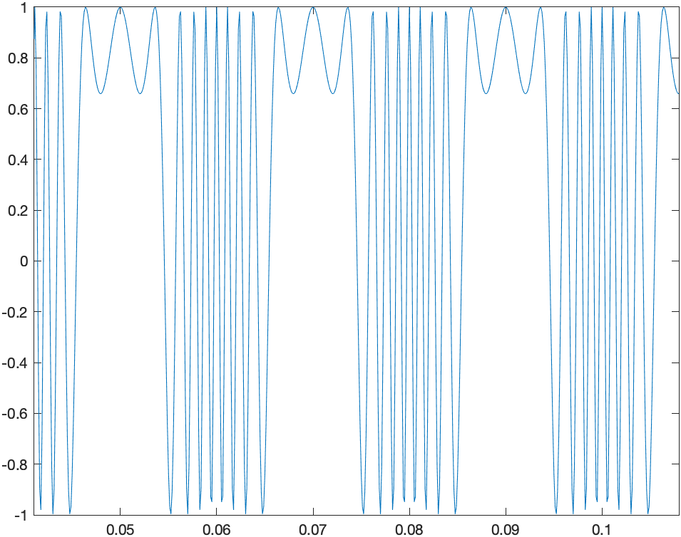
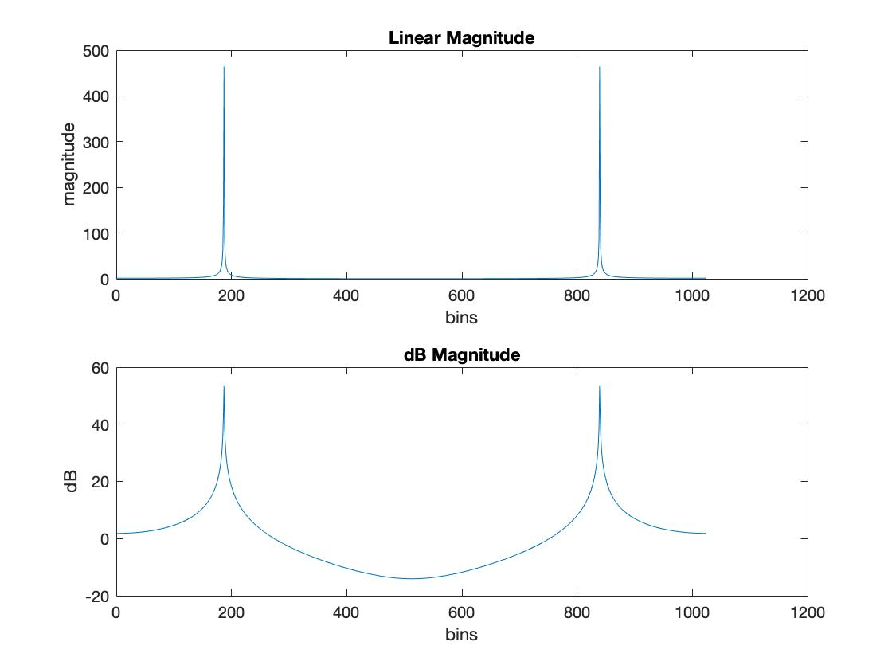
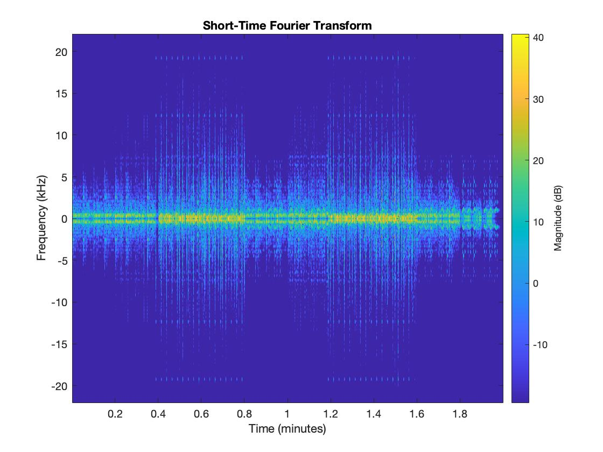
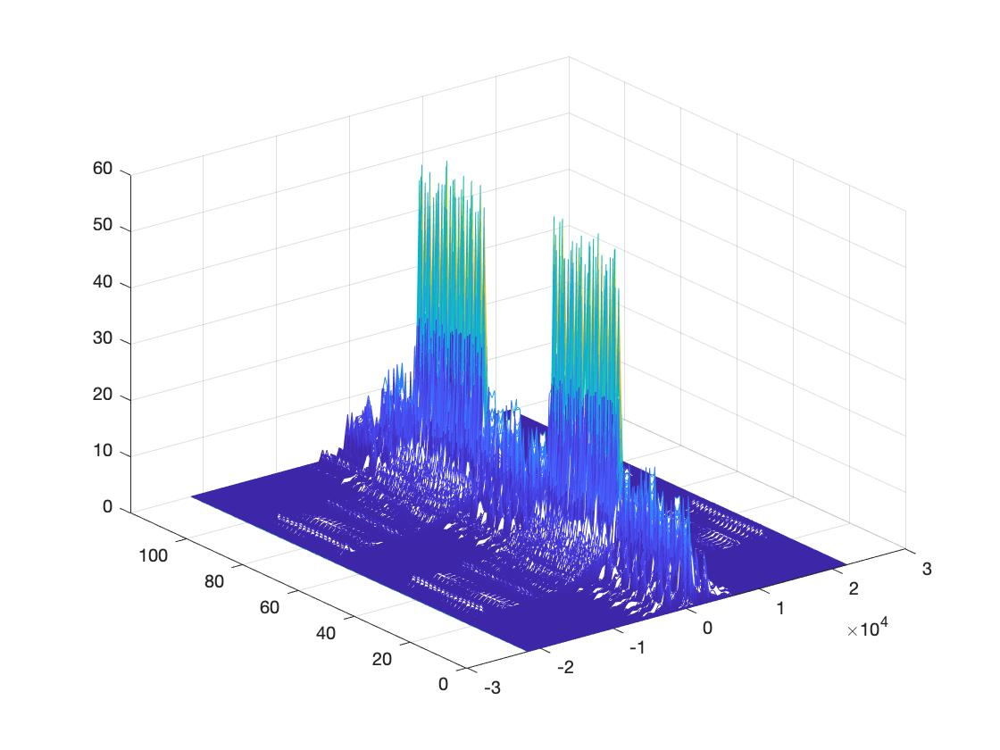

# DSP

## Code snippet

### Sine tone

```
y = sin(2*pi*440/44100*[0:44099]);

sound(y, 44100);
```

### Amplitude envolope and ADSR

```
[x, fs] = audioread('NSynthTryOut.wav'); % read wave file
xReverse = flipud(x); % flip the array up -> down

sound(xReverse, fs);

audiowrite('NSynthTryOutReverse.wav', xReverse, fs);
```

### Window

```
[x, fs] = audioread('NSynthTryOut.wav'); % read wave file 
xWindowed = x(1:500);

sound(xWindowed, fs);
```

### Up-sampling and Down-sampling

```
[x, fs] = audioread('NSynthTryOut.wav'); % read wave file 

% up-sampling
sound(upsample(x, 2), fs);

% down-sampling
sound(downsample(x, 2), fs);
```

### Dynamic compressor

```
[x, fs] = audioread('NSynthTryOut.wav'); % read wave file 

theSign = sign(x); % retain sign of waveform
x = abs(x); % get absolute value of x

slope = 2;
intercept = 1;
threshold = 0.2;

for i=1:length(x)
  if x(i) > threshold
    % compress
    y(i) = (slope*x(i) + intercept)*theSign(i); 
  else
    % do not compress
    y(i) = x(i)*theSign(i); 
  end
end

audiowrite('NSynthTryOutCompressor.wav', y, fs);
```

### Chebyshev polynomials of the 1st kind

```
[x, fs] = audioread('NSynthTryOut.wav'); % read wave file

t1 = x;
t3 = 4*(x.^3) - 3*x;
t5 = 16*(x.^5) - 20*(x.^3) + 5*x;

y1 = t1;
audiowrite('NSynthTryOutCos1.wav', y1, fs);

y3 = t1 + 1/3*t3;
audiowrite('NSynthTryOutCos3.wav', y3, fs);

y5 = t1 + 1/3*t3 + 1/5*t5;
audiowrite('NSynthTryOutCos5.wav', y5, fs);
```

### Sine wave plotting

```
[x, fs] = audioread('NSynthTryOut.wav'); % read wave file

dt = 1/fs;
startTime = 0; % seconds
endTime = 2*60; % seconds

t = (startTime:dt:endTime-dt)';

figure;
plot(t, x);
xlabel('time (in seconds)');
title('Signal versus Time');
zoom xon;
```

<p float="left">
	
	
</p>

### Beating

```
duration = 4; % duration = 4 seconds
fs = 8000;
dt = 1/fs;

f1 = 400;
y1 = cos(2*pi*f1/fs*[0:fs*duration-1]);
sound(y1, fs);

f2 = 404;
y2 = cos(2*pi*f2/fs*[0:fs*duration-1]);
sound(y2, fs);

y = y1+y2;
sound(y, fs);

figure;
t = (0:dt:duration-dt)';
plot(t, y);
```

<p float="left">
	
</p>

### Amplitude modulation

```
duration = 4; % duration = 4 seconds
fs = 44100;
dt = 1/fs;

fc = 400;
yc = cos(2*pi*fc/fs*[0:fs*duration-1]);
sound(yc, fs);

fm = 50;
ym = cos(2*pi*fm/fs*[0:fs*duration-1]);
sound(ym, fs);

ac = 1;
am = 1;
y = yc.*(am*ym + ac);
sound(y, fs);

figure;
t = (0:dt:duration-dt)';
plot(t, y);
zoom xon;
```

<p float="left">
	
</p>

### Frequency modulation

```
duration = 4; % duration = 4 seconds
fs = 8000;
dt = 1/fs;

fc = 400;
yc = cos(2*pi*fc/fs*[0:fs*duration-1]);
sound(yc, fs);

ac = 1;
am = 500; % delta of frequency swing
fm = 50;

y = ac*cos(2*pi*fc/fs*[0:fs*duration-1] + am/fm*sin(2*pi*fm/fs*[0:fs*duration-1]));
sound(y, fs);

figure;
t = (0:dt:duration-dt)';
plot(t, y);
zoom xon;
```

<p float="left">
	
	
</p>

### Twin peaks

```
[x, fs] = audioread('NSynthTryOut.wav'); % read wave file

dt = 1/fs;
duration = 15; % seconds

xWindow = x(30*fs:(30+duration)*fs-dt);

fm = 10;
ym = cos(2*pi*fm/fs*[0:fs*duration-1]);

ac = 1;
am = 1;
y = xWindow.*(am*ym + ac);

sound(y, fs);
audiowrite('NSynthTryOutTwinPeaks.wav', y, fs);
```

### FFT

```
f = 4000;
fs = 22050;
fftLength = 1024; % window length

x = sin(2*pi*f*[0:1/fs:1]); % make the sine wave
ft = fft(x, fftLength); % do FFT, use rect. window
ftMag = abs(ft); % compute magnitude

% plot the results both in linear and dB magnitudes
subplot(2, 1, 1), plot(ftMag);
title('Linear Magnitude'), ylabel('magnitude'), xlabel('bins');

subplot(2, 1, 2), plot(20*log10(ftMag));
title('dB Magnitude'), ylabel('dB'), xlabel('bins');
```

<p float="left">
	
</p>

### STFT

```
[x, fs] = audioread('NSynthTryOut.wav'); % load an audio file

stft(x(:,1),fs,'Window',kaiser(256,5),'OverlapLength',220,'FFTLength',512); % plot 1

[S,F,T] = stft(x,fs,'Window',hamming(128,'periodic'),'OverlapLength',50); % plot 2
waterfall(F,T,abs(S(:,:,1))')
helperGraphicsOpt(1)
```

<p float="left">
	
    
</p>

## References
* https://www.sfu.ca/~truax/river.html
* https://en.wikipedia.org/wiki/Chebyshev_polynomials
* https://nl.mathworks.com/help/symbolic/chebyshevt.html
* https://nl.mathworks.com/help/signal/ref/stft.html
