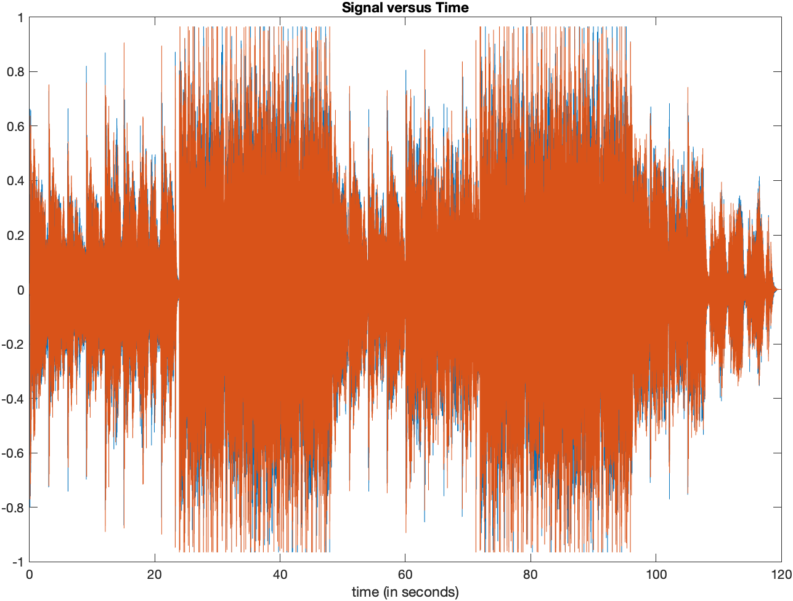
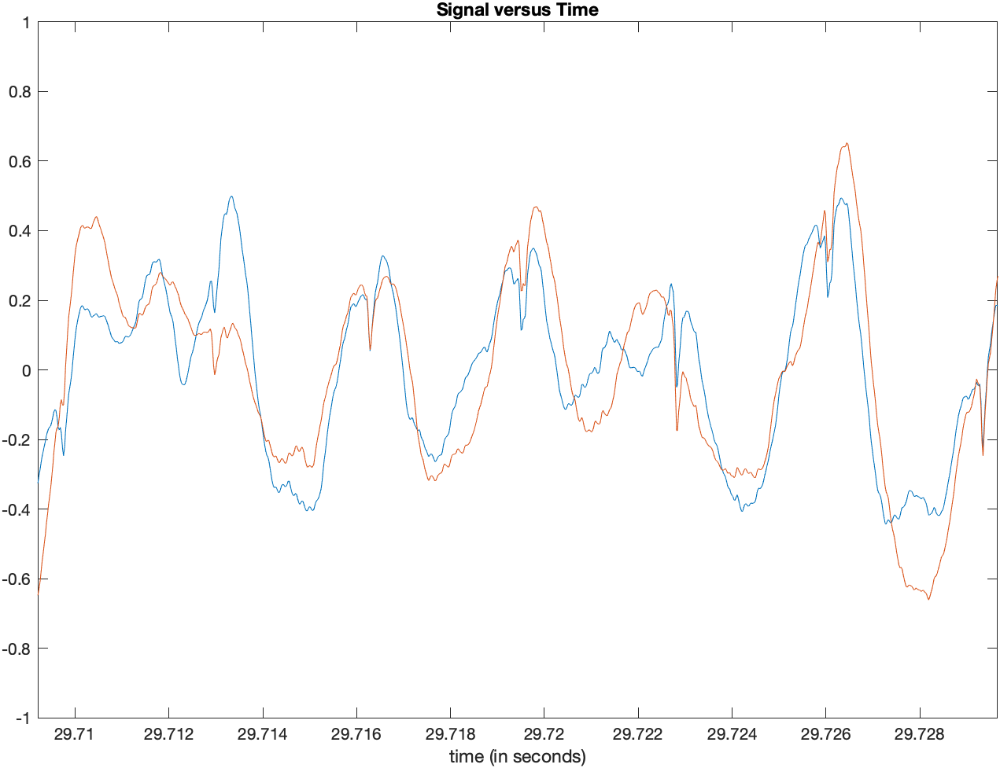

# DSP

## Code snippet

### Sine tone

```
y = sin(2*pi*440/44100*[0:44099]);

sound(y, 44100);
```

### Amplitude envolope and ADSR

```
[x, fs] = audioread('NSynthTryOut.wav'); % read wave file
xReverse = flipud(x); % flip the array up -> down

sound(xReverse, fs);

audiowrite('NSynthTryOutReverse.wav', xReverse, fs);
```

### Window

```
[x, fs] = audioread('NSynthTryOut.wav'); % read wave file 
xWindowed = x(1:500);

sound(xWindowed, fs);
```

### Up-sampling and Down-sampling

```
[x, fs] = audioread('NSynthTryOut.wav'); % read wave file 

% up-sampling
sound(upsample(x, 2), fs);

% down-sampling
sound(downsample(x, 2), fs);
```

### Dynamic compressor

```
[x, fs] = audioread('NSynthTryOut.wav'); % read wave file 

theSign = sign(x); % retain sign of waveform
x = abs(x); % get absolute value of x

slope = 2;
intercept = 1;
threshold = 0.2;

for i=1:length(x)
  if x(i) > threshold
    % compress
    y(i) = (slope*x(i) + intercept)*theSign(i); 
  else
    % do not compress
    y(i) = x(i)*theSign(i); 
  end
end

audiowrite('NSynthTryOutCompressor.wav', y, fs);
```

### Chebyshev polynomials of the 1st kind

```
[x, fs] = audioread('NSynthTryOut.wav'); % read wave file

t1 = x;
t3 = 4*(x.^3) - 3*x;
t5 = 16*(x.^5) - 20*(x.^3) + 5*x;

y1 = t1;
audiowrite('NSynthTryOutCos1.wav', y1, fs);

y3 = t1 + 1/3*t3;
audiowrite('NSynthTryOutCos3.wav', y3, fs);

y5 = t1 + 1/3*t3 + 1/5*t5;
audiowrite('NSynthTryOutCos5.wav', y5, fs);
```

### Sine wave plotting

```
[x, fs] = audioread('NSynthTryOut.wav'); % read wave file

dt = 1/fs;
startTime = 0; % seconds
endTime = 2*60; % seconds

t = (startTime:dt:endTime-dt)';

figure;
plot(t, x);
xlabel('time (in seconds)');
title('Signal versus Time');
zoom xon;
```

<p float="left">
	
	
</p>

## References
* https://www.sfu.ca/~truax/river.html
* https://en.wikipedia.org/wiki/Chebyshev_polynomials
* https://nl.mathworks.com/help/symbolic/chebyshevt.html
