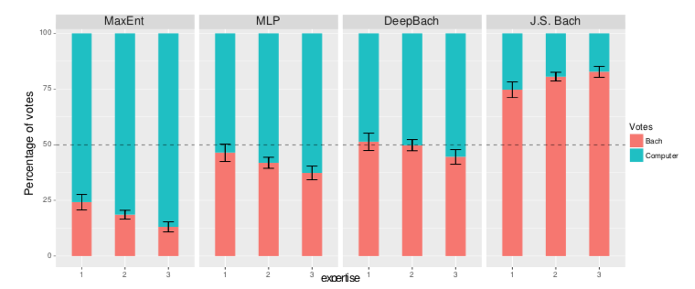
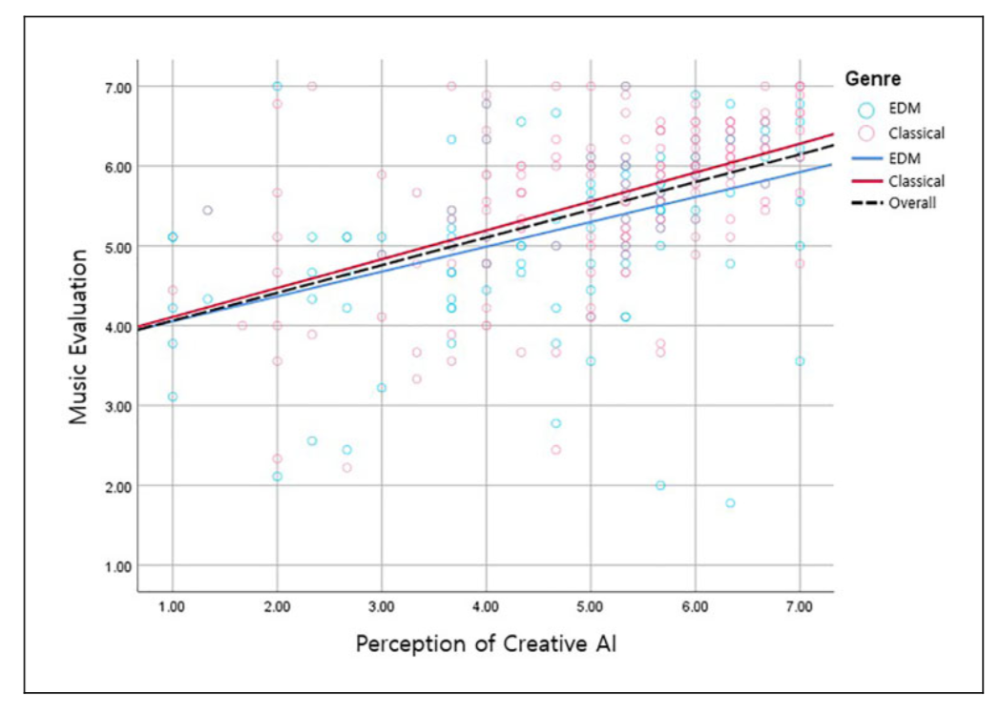

# MIR

## Questions

Evaluating the AI-generated songs in a musical-Turing-test way has been carried out for a bunch of genres, such as (1) "DeepBach: a Steerable Model for Bach Chorales Generation"; (2) the case with Amper ([https://soundcloud.com/tarynsouthern/original-amper-file-second-chance/s-k6kga](https://soundcloud.com/tarynsouthern/original-amper-file-second-chance/s-k6kga) and [https://www.youtube.com/watch?v=XUs6CznN8pw&feature=emb_title](https://www.youtube.com/watch?v=XUs6CznN8pw&feature=emb_title)).

	  
	<em>The figure shows the distribution of the votes between “Computer” (blue bars) and “Bach” (red bars) for each model and each level of expertise of the voters (from 1 to 3)</em>

But in these evaluations, they kinda lack more insightful information, which can guide the musicians and musicologists. These lingering questions are: (1) What patterns underneath constitute a Bach-like classical music? (2) What is the difference between the true Bach patterns and the AI-generated ones? (3) If the music can be expressed in a symbolic format, can the symbolic or digital format extend the boundaries of music?

The following figure shows that the evaluation of AI-composed music is highly correlated with the audience's perception of creative AI, which means: if the audience is tech-savvy, he or she may also tend to enjoy AI music (but just for an instant of fun or really appreciate it?). So deep down, to simply ask listeners/experts about their opinion for a specific genre might shed little light on the core of music. And we need to explore the mathematical patterns of music as a whole, the creativity and the genes of music (but how?).

	  
	<em>The regression analysis of the relationship between the perception of creative AI and the evaluation of AI-composed music.</em>

## Todos

- [x] Smarter everyday Fourier series
- [x] Spectrogram
- [ ] Keyscape
- [ ] Scape plot
- [ ] Inner metric analysis

## References
* https://www.sonicvisualiser.org/
* https://vamp-plugins.org/index.html
* https://www.justinsalamon.com/melody-extraction.html
* http://www.isophonics.net/nnls-chroma
* http://jmir.sourceforge.net/manuals/jSymbolic_manual/home.html
* https://github.com/dmcennis/jaudioGIT
* http://jaudio.sourceforge.net/jaudio10/features/feature.html
* http://jmir.sourceforge.net/ACE.html
* http://jmir.sourceforge.net/
* https://mathworld.wolfram.com/WallpaperGroups.html
* https://mathworld.wolfram.com/FourierSeries.html
* https://wiki.python.org/moin/PythonInMusic
* https://ccrma.stanford.edu/~craig/keyscape/class/
* https://ccrma.stanford.edu/~craig/keyscape/
* https://program.ismir2020.net/poster_1-17.html
* http://people.csail.mit.edu/mrub/VisualMic/
* http://people.csail.mit.edu/nwadhwa/phase-video/
* https://www.audiolabs-erlangen.de/fau/professor/mueller/notebookFMP
* https://juce.com/discover/stories/adc-2020
* https://audio.dev/
* https://mtg.github.io/JAAH/
* http://pcm.sapp.org/timeline/
* http://www.computermusic.org/page/23/
* https://github.com/bzamecnik/midi2audio
* https://musescore.org/en/handbook/soundfonts-and-sfz-files#list
* https://github.com/zwaltman/keyedin
* https://imslp.org/wiki/Prelude_and_Fugue_in_A_minor,_BWV_865_(Bach,_Johann_Sebastian)
