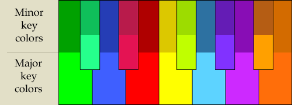
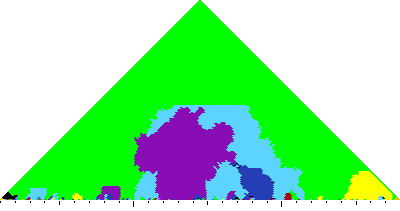
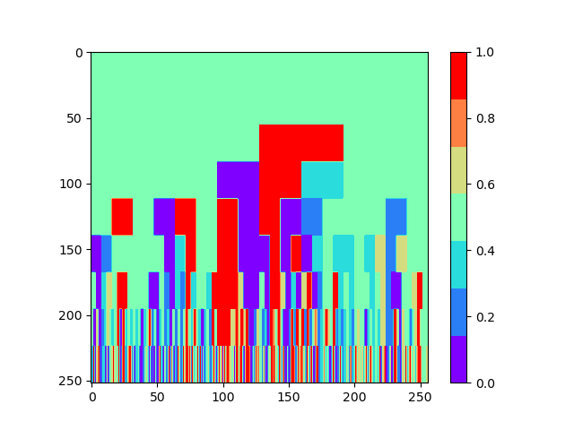
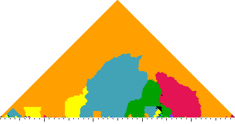
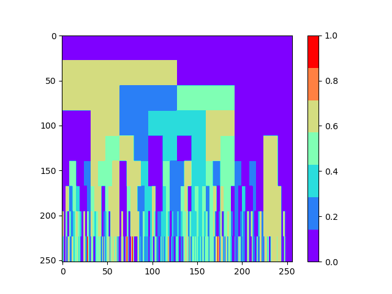
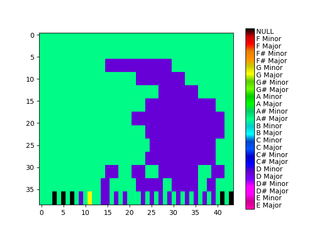
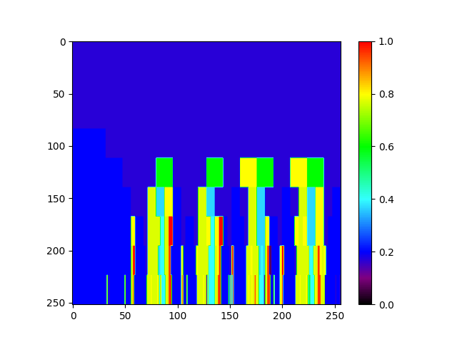

# Keyscape

## Todos
- [ ] Minor key colors
- [ ] Krumhansl-Schmuckler key-finding: scale profile?
- [ ] Raw audio has lower accuracy?

## Key colors

    

## Result of Fugue

    <em>Fugue No. 1 in C major, BWV 846</em>

    
    

    <em>Fugue No. 21 in B♭ major, BWV 866</em>

    
    

## Result of Electro Swing

    <em>Chambermaid Swing from Parov Stelar - Left: MIDI file, Right: WAV file</em>

    
    

## References
* http://extras.humdrum.org/man/mkeyscape/wtc/
* http://extras.humdrum.org/man/mkeyscape/index.html#l_option
* https://github.com/zwaltman/keyedin
* https://github.com/stevetjoa/musicsearch
* https://en.wikipedia.org/wiki/Circle_of_fifths
