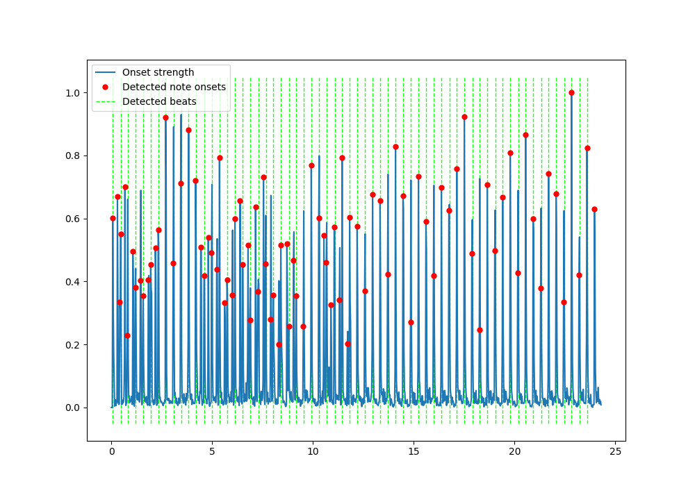

# Pulse

## Result

    

## References
* https://pysoundfile.readthedocs.io/en/latest/index.html#soundfile.write
* https://librosa.org/doc/latest/generated/librosa.onset.onset_strength.html
* https://librosa.org/doc/latest/generated/librosa.feature.tempogram.html
* https://librosa.org/doc/latest/generated/librosa.feature.inverse.mel_to_audio.html
* https://en.wikipedia.org/wiki/Cepstrum
* https://musicinformationretrieval.com/
* https://github.com/csteinmetz1/NeuralReverberator
* https://www.christiansteinmetz.com/projects-blog/neuralreverberator
* https://www.openairlib.net/
* http://isophonics.net/content/room-impulse-response-data-set
* https://docs.scipy.org/doc/scipy/reference/signal.html
* https://nl.mathworks.com/help/audio/ref/audiotestbench-app.html
