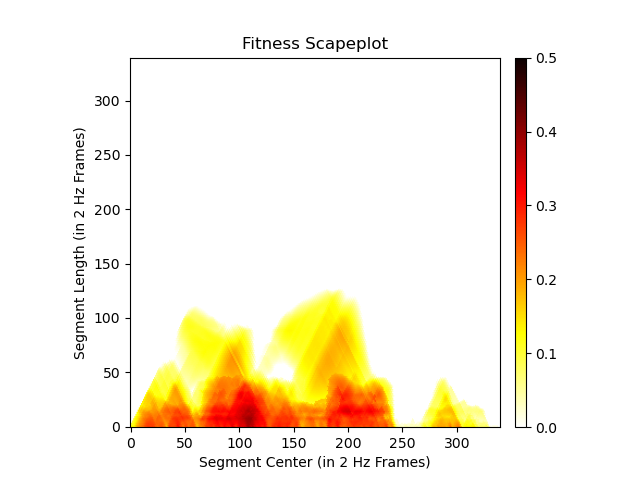

# Fitness scape plot

## Code

### Generate the scape plots

* -a: input audio directory
* -s: output directory for SSMs
* -p: output directory for scape plots
* -j: number of processes spawned for scape plot computation (optional, defaults to 1; 2~4 is recommended)

```
python run_scapeplot.py -a data/audio -s data/ssm -p data/scplot -j 2
```

### Visualize the scape plots

* -p: input scape plots directory
* -f: output scape plot figures directory

```
python vis_scapeplot.py -p data/scplot -f data/scfig 
```

## Result

<p float="left">
    
</p>

## References
* https://github.com/slSeanWU/MusDr
* https://soundcloud.com/electroswing