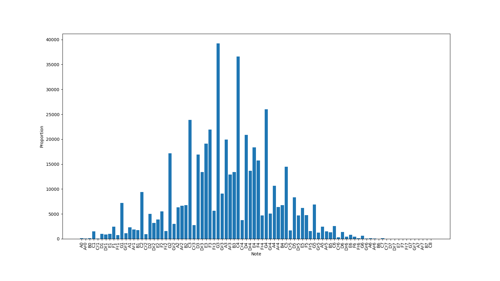
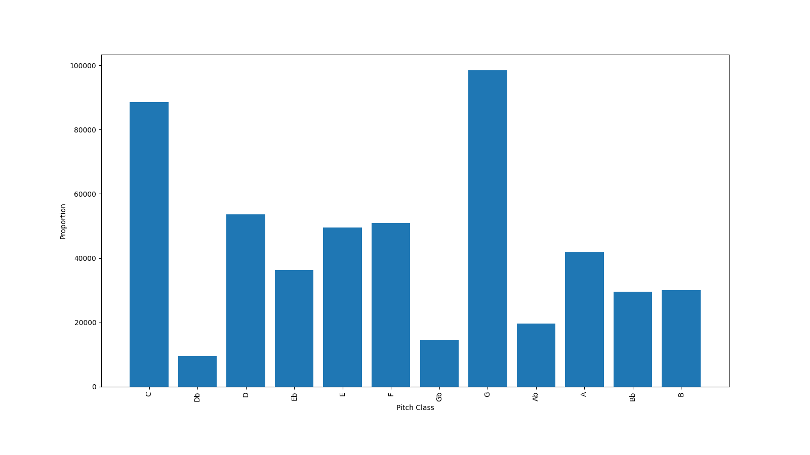

# Electro Swing

## Pitch distribution

After being transposed to C major / minor, the pitch distribution of Jazz pianos is as below:

<p float="left">
    
</p>

## Pitch class distribution

After being transposed to C major / minor, the pitch class distribution of Jazz pianos is as below:

<p float="left">
    
</p>

## Prerequisites
```bash
brew install unrar
unrar x <filename>
```

## References
* http://web.mit.edu/music21/
* http://web.mit.edu/music21/doc/index.html
* https://github.com/craffel/pretty-midi
* https://nbviewer.jupyter.org/github/craffel/pretty-midi/blob/master/Tutorial.ipynb
* https://github.com/justinsalamon/audio_to_midi_melodia
* https://librosa.org/doc/main/generated/librosa.midi_to_note.html#librosa.midi_to_note
* http://newt.phys.unsw.edu.au/jw/notes.html
