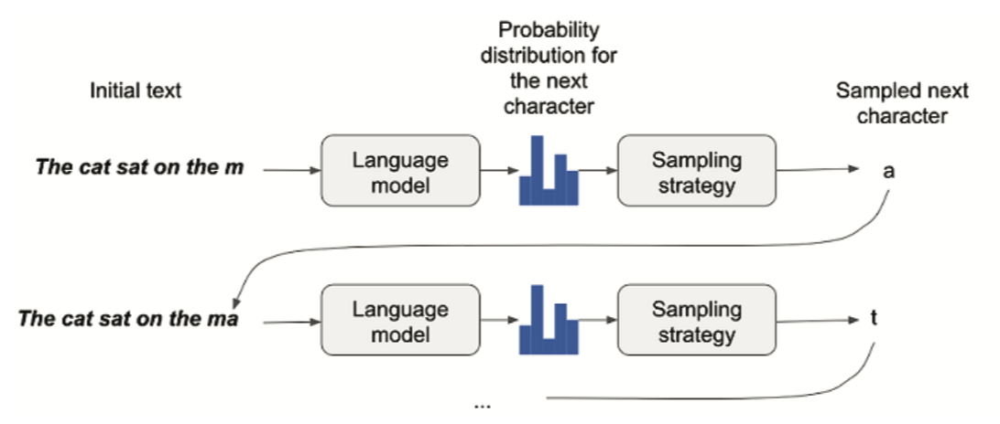

# RNN

## Sampling strategy

    

## References
* https://github.com/IraKorshunova/folk-rnn
* https://folkrnn.org/
* http://abcnotation.com/software#AbcConverter
* https://wiki.python.org/moin/PythonInMusic
* https://docs.conda.io/projects/conda/en/latest/user-guide/tasks/manage-environments.html
* https://keras.io/examples/
